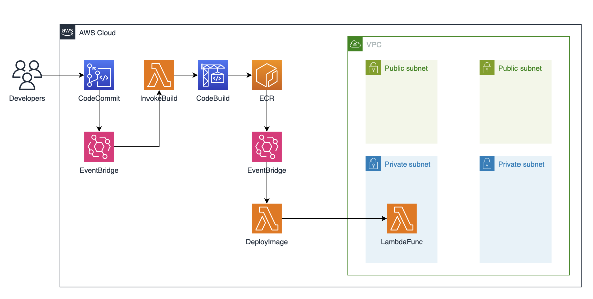
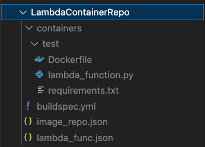
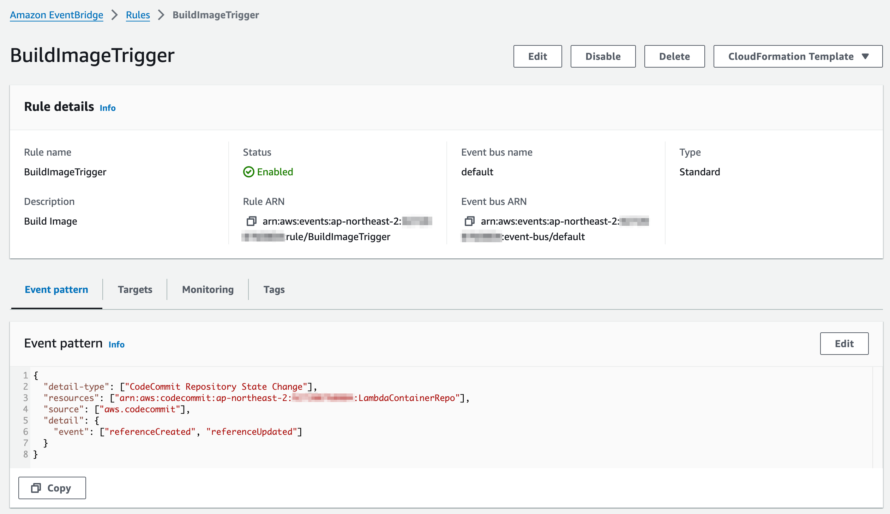
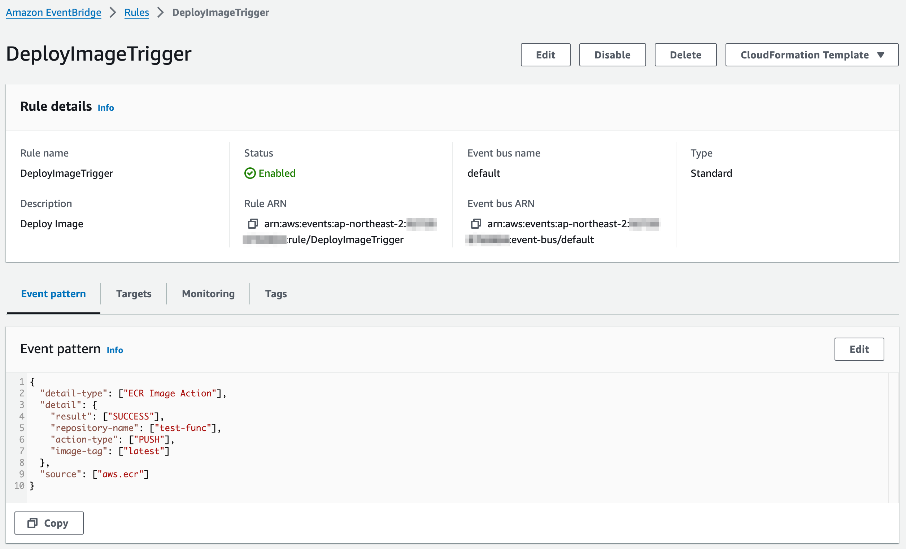

# Bedrock Demo
This repository is a Gen AI demo using claude 3. It contains 5 pre-builts examples which help customers getting started with the Amazon Bedrock.



## Prerequisites
- Make sure you have [AWS CLI](https://docs.aws.amazon.com/cli/latest/userguide/install-cliv2.html) installed and configured with an aws account you want to use.


### install cdk
```shell
npm install -g aws-cdk
cdk --version
```

### setting AWS_PROFILE
```shell
export AWS_PROFILE=<the configuration profile for aws-cli>
```

## How to deploy

### Step 1. Create virtualenv
After cloning this git repository. You need to create virtualenv.
```shell
cd lambda-container-automation
python3 -m venv .venv
source .venv/bin/activate
```

### Step 2. Install requirements
```shell
pip install -r requirements.txt
```

### Step 3. Deploy CDK 
```shell
cdk deploy LambdaContainerAutomationStack
```

### Step 4. Create ECR
```shell
aws ecr create-repository --repository-name prompt-func
aws ecr set-repository-policy --repository-name prompt-func --policy-text file://ecr-lambda-policy.json
```
This example creates two lambda functions, one is InvokeBuild, the other is DeployImage. DeployImage get the container image from ECR and creates or updates lambda function. It needs to have some permissions for DeployImage to pull container image from ECR. This permissions have to be set on ECR repository. the set-repository-policy is doing this job.

### Step 5. Clone Git
1. Execute the command below and copy the output. the output is the URL of the created codecommit repository.

```shell
aws codecommit get-repository --repository-name LambdaContainerRepo --query repositoryMetadata.cloneUrlHttp --output text --no-cli-pager
```

2. Clone git with the URL
In lambda-container-automation directory.

```shell
git clone [the URL that you copied]
```

ex.)
```
ex.) git clone https://git-codecommit.xxxxx.amazonaws.com/v1/repos/LambdaContainerRepo
```  

#### Directory Structure
Change directory to the cloned repository.

ex.)
```shell
cd LambdaContainerRepo 
```



1. Under the containers/test directory
* Dockerfile - This example uses an AWS base image for Lambda to make lambda container image.
* lambda_function.py - The main code for lambda handler
* requirements.txt - The python library to be installed

2. buildspec.yml

this file is used in CodeBuild to build the lambda container image.

3. image_repo.json

this json file is used in InvokeBuild lambda function, it contains Directory and ECR repository mapping.

* Directory : the directory path that contains source code of lambda function. ex.) containers/test
* ECR repository : the repository that contains lambda container image. ex.) test-func

InvokeBuild lambda function detects the changes of the CodeCommit repository and extracts the changed directory. then it invokes CodeBuild instance to build container image. The container image will be pushed to ECR repository. So, Before calling CodeBuild instance, it needs to know which ECR repository the built container image will be pushed to.

4. lambda_func.json

this json file is used in DeployImage lambda function, it contains ECR respository and Lambda Function Name mapping.

* ECR repository : the repository that contains lambda container image. ex.) prompt-func
* Lambda Function Name : the name of lambda function to be created or updated. ex.) PromptFunc

DeployImage lambda function will be invoked after the conatiner image is pushed to ECR repository. It will create or update lambda function with the conatiner image. To do so, it needs to know the name of the lambda function.

### Step 6. Edit lambda function
1. In containers/test directory, there is lambda_function.py. Edit like below or if you know python then you can edit whatever you want.

```python
import json

def lambda_handler(event, context):
    print(event)

    input_text = event['body']

    return {
        'statusCode': 200,
        'body': f'Output is {input_text}'
    }
```

2. Then push it. Like below.
```shell
git add .
git commit -m "initial commit"
git push
```

After some time, go to Lambda console. You will find **PromptFunc** in the function list.


### Step 7. Create lambda function
1. In containers directory, create helloworld directory and copy all files in test.

```shell
cd containers
mkdir helloworld
cd helloworld
cp ../test/* .
```

2. Edit containers/helloworld/lambda_function.py like below.

```python
import json

def lambda_handler(event, context):

    return {
        'statusCode': 200,
        'body': 'Hello, World!'
    }
```

You can edit Dockerfile and requirements.txt as you like.

3. Create ECR repository
```shell
cd ../../
aws ecr create-repository --repository-name hello-world
aws ecr set-repository-policy --repository-name hello-world --policy-text file://../ecr-lambda-policy.json
```

4. Add Directory and ECR repository mapping to image_repo.json
```json
{
    "containers/prompt": "prompt-func",
    "containers/helloworld": "hello-world"
}
``` 

5. Add ECR respository and Lambda Function Name mapping to lambda_func.json
```json
{
    "prompt-func": "PromptFunc",
    "hello-world": "HelloWorld"
}
```

6. Add repository name to EventBridge rule.

Execute this command. You will get temp.json
```shell
aws events describe-rule --name DeployImageTrigger --query EventPattern | jq fromjson > temp.json
```

Open temp.json and add hello-world at repository-name.

Before
```json
{
  "detail-type": [
    "ECR Image Action"
  ],
  "detail": {
    "result": [
      "SUCCESS"
    ],
    "repository-name": [
      "prompt-func"
    ],
    "action-type": [
      "PUSH"
    ],
    "image-tag": [
      "latest"
    ]
  },
  "source": [
    "aws.ecr"
  ]
}
```

After
```json
{
  "detail-type": [
    "ECR Image Action"
  ],
  "detail": {
    "result": [
      "SUCCESS"
    ],
    "repository-name": [
      "prompt-func",
      "hello-world"
    ],
    "action-type": [
      "PUSH"
    ],
    "image-tag": [
      "latest"
    ]
  },
  "source": [
    "aws.ecr"
  ]
}
```

After editting temp.json, update EventBridge rule.
```shell
aws events put-rule --name DeployImageTrigger --event-pattern file://temp.json --no-cli-pager
rm temp.json
```

7. Then push it. Like below.
```shell
git add .
git commit -m "hello world"
git push
```

After some time, go to Lambda console. You will find **HelloWorld** in the function list.


#### EventBridge Rules
There are two EventBridge rules.

1. BuildImageTrigger

After you push the code to CodeCommit, EventBridge will catch the CodeCommit event, then it will trigger InvokeBuild lambda function. 



2. DeployImageTrigger

After CodeBuild successfully pushes the container image to ECR, EventBridge will catch the ECR event, then it will trigger DeployImage lambda function. When you create a ECR repository, you have to add the name of the ECR repository to this rule.



## Clean up resources

### Delete Lambda Function
```shell
aws lambda delete-function --function-name TestFunc
aws lambda delete-function --function-name HelloWorld
```

### Delete ECR
```shell
aws ecr delete-repository --repository-name test-func --force
aws ecr delete-repository --repository-name hello-world --force
```

### Delete parameter in Parameter Store 
```shell
aws ssm delete-parameter --name last_commit_id
```

### Destroy Stack
```shell
cdk destroy LambdaContainerAutomationStack
```


###
```shell
streamlit run frontUI/home.py
```